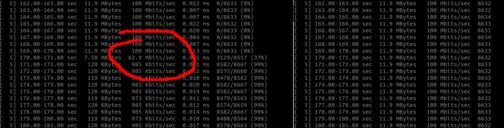

# Traffic Control Manager
 
 
## ¿What is for?
TC-manager offers a REST API and a Web UI to configure traffic ingress control over a set of network interfaces.

It belongs to the Arqueopterix Project and It is used to offer traffic flow shapping for multiple traffic flows.
In the project the TC-manager manages the interfaces of a router connecting a set of clients with a video server.
There is a default rate configure that is shared among all clients. If you want to offer better QoS to a single client,
you can add a policy matching her traffic flow and providing a fixed rate for here.   

More information of the Arqueopterix project at: [https://www.arqueopterix.es](https://www.arqueopterix.es).
 
## License
LICENSE.md file
 
  
## Dependencies
List of dependencies
- External dependencies
    * **python3**
    * **Flask** 1.0.2
    
Dependencies can be install with
 
```python3 -m pip install -r requirements.txt```
  
## Getting Started

Before running tc-manager you MUST create the same Intermediate Functional Blocks (ifb0, ifb1, ifb2, etc) as the
number of managed interfaces. Example for 3 interfaces:

 ``` 
 modprobe -r ifb
 modprobe ifb numifbs=3
 ip link ifb0 set up
 ip link ifb1 set up
 ip link ifb2 set up
 ```
 
To run tc-manager docker container to set policies in your host interfaces you have to:

 - use --net=host to allow container access your HOST network interface.
 - use --cap-add NET_ADMIN to grant container the privilege to admin host networking.
 - mount your host /proc into the container /proc.

This can be done with the following command:

```
docker run --rm -ti --cap-add NET_ADMIN --net=host -v /proc:/proc tc-manager:0.1.0 
```

You can now access the tc-manager ui at [http://localhost:5000](http://localhost:5000).


## Configuration
tc-manager receives the list of interfaces to manage as arguments.
For example, in the getting started script it is launch as:
```
python3 tc_manager_rest.py vethXXX vethYYY
```

You can write your custom python code for advance configuration. The NetworkInterfaces class of tc_manager module accepts a whitelist and a blacklist initial parameters:
```
    def __init__(self, whitelist = None, blacklist=[]):
```
- whitelist: an array with the network interface names to manage. If set to None it will take all network interfaces.
- blacklist: an array of network interfaces to remove from the management list. For example, typically you don't want to manage *lo* interface.
 

## Quick Test
To make a quick local test of tc-manager we are going to shape the traffic between two containers.
The ```sudo ./run.sh``` deploys the testing scenario.

It deploys two iperf3 docker containers *h1* and *h2* connected to a docker network *tcnet*.
Then it launches the docker tc-manager into the host network to manage the ingress traffic of vethXXXX and vethYYYY tcnet interfaces:

```
 ____________     _______________________     ____________
|   h1       |   |       host network    |   |   h2       |
| __________ |   | _________   _________ |   | __________ |
|| eth0     ||   || vethXXX | | vethYYY ||   || eth0     ||
||172.30.0.1||   ||_________|_|_________||   ||172.30.0.2||
      |________________|           |_______________|

``` 
Open a terminal and run iperf3 server at h1: 

`docker exec -ti h1 iperf3 -s`

In a second terminal Start a 10-minutes UDP flow from h2 to h1: 

`docker exec -ti h2 iperf3 -c 172.30.0.1 -u -b 100Mbps -t 600`

Open [tc-manager-ui](http://localhost:5000) and select h2 vethYYY interface to shape h2->h1 flow.
To get vethYYY real name you can exec:

```
./get_veth_pair.sh h2
```

First add a default_rate of 1Mbit and check iperf3 server output (h1).


Received rate should mirror default_rate.



Add a policy for the h2->h1 udp flow. One or several of the following matching criteria should work:
- src_ip: 172.30.0.2
- dst_ip: 172.30.0.1
- dst_port: 5201


Received rate should mirror the policy rate.


## Versions

- **0.2.0**
Released 11 of March 2019
 
  **Changelog**
 
  - Bitrate control is now implemented as a tc htb class in an Intermediate Functional Block device (ifb0) instead of 
  an ingress filter (TCP does not behave correctly when using ingress filter)
 
- **0.1.0**
Released 05 of February 2019
 
  **Changelog**
 
  - Initial code.
